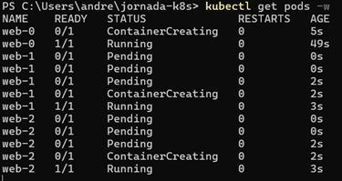
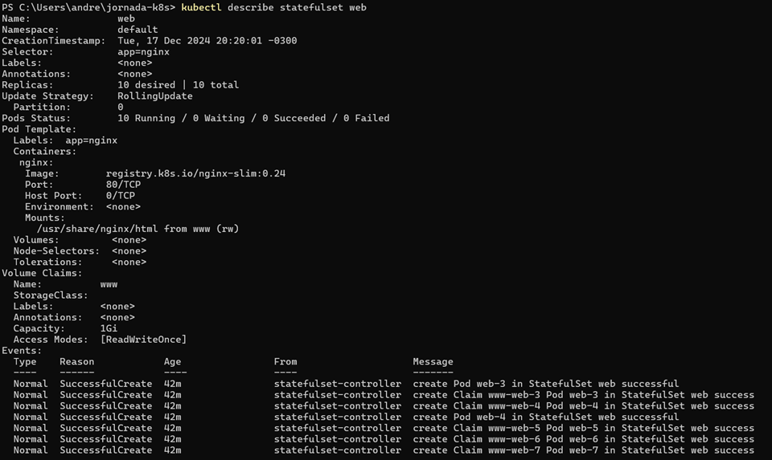
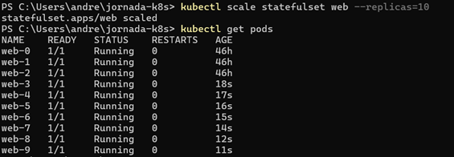
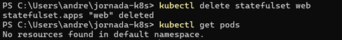

# StatefulSets 

Este material complementa a seção sobre StatefulSets, fornecendo exemplos e explicações sobre manifestos e demonstrações de recursos importantes.

## Manifesto YAML

A seguir um exemplo de um manifesto básico de um StatefulSet: 

```yaml
apiVersion: apps/v1
kind: StatefulSet
metadata:
  name: web
spec:
  selector:
    matchLabels:
      app: nginx 
  serviceName: "nginx"
  replicas: 3   
  template:
    metadata:
      labels:
        app: nginx  
    spec:
      containers:
      - name: nginx
        image: registry.k8s.io/nginx-slim:0.24
        ports:
        - containerPort: 80
          name: web
        volumeMounts:
        - name: www
          mountPath: /usr/share/nginx/html
  volumeClaimTemplates:
  - metadata:
      name: www
    spec:
      accessModes: [ "ReadWriteOnce" ]
      resources:
        requests:
          storage: 1Gi
```
No exemplo, é criado um StatefulSet chamado `web` que cria 3 réplicas de um pod contendo um container que utiliza a imagem `nginx-slim:0.24`. `volumeClaimTemplates` é o bloco que define um template para os PVCs(Persistent Volume Claim), onde cada pod terá seu próprio PVC baseado nesse template.

Podemos observar a ordem que o StatefulSet respeita no momento da criação dos seus pods conforme abaixo: 



Perceba que o pod web-1 só aparece depois que o pod web-0 está pronto. Assim como o web-2 só aparece depois que o web-1 fica pronto.

## Headless Service

Um Headless Service é diferente dos Services comuns. Ele não recebe um IP, em vez disso, usa o DNS para retornar diretamente os IPs dos Pods que fazem parte desse Service. Dessa forma, os clientes podem se conectar diretamente aos pods sem passar por um proxy ou balanceador de carga.

```yaml
apiVersion: v1
kind: Service
metadata:
  name: nginx
  labels:
    app: nginx
spec:
  ports:
  - port: 80
    name: web
  clusterIP: None
  selector:
    app: nginx
```
É exatamente a configuração `clusterIP: None` que define o Service como headless. Com essa configuração, o DNS pode responder com registros como: 

- `<nome-do-servico>.<namespace>.svc.cluster.local`

Ou aplicando o padrão ao manifesto anterior, teríamos o registro DNS:

- `nginx.default.svc.local`

Na prática, o headless service provê as identidades fixas e comunicação direta entre os pods.

## Listando um StatefulSet e seus pods

Para listar StatefulSets, utilizamos o comando: 

``` kubectl get statefulset ``` 

na figura também mostramos a listagem dos pods correspondente ao statefulset:


## Detalhando um StatefulSet

Para consultarmos maiores detalhes sobre um StatefulSet, utilizamos o comando: 

``` kubectl describe statefulset web```

a resposta esperada do comando será parecida com:



Aqui podemos ver os detalhes a respeito do statefulset, inclusive os eventos relacionados a ele como criação de pods e seus respectivos PVCs, conforme a imagem.

## Escalando um StatefulSet

A forma de escalar réplicas no StatefulSet é muito parecida como se faz nos Deployments.
Lembrando que quando falamos em escalar significa aumentar ou diminuir o número de réplicas de acordo com sua demanda com objetivo de aproveitar melhor os recursos computacionais e financeiros. 

Você pode escalar um Statefulset usando o seguinte comando: 

``` kubectl scale statefulset/web --replicas=10 ```

Onde é especificado:

`statefulset/web`: nome do Statefulset que será escalado

`--replicas=10`: define a nova quantidade de replicas 

Será exibida uma saída parecida com:

``` statefulset.apps/web scaled ```



## Estratégias de atualizações

As estratégias de atualização de StatefulSets são um pouco diferente dos Deployments. Temos 2 opções de estratégias para os StatefulSets:

- **OnDelete**: é a estratégia usada por padrão. Usar essa estratégia significa que as atualizações não serão automáticas. É necessário deletar manualmente um pod, para quando ele seja recriado com a configuração nova.

- **Rolling Update**: exatamente como nos Deployments, o rolling update faz a substituição um a um dos antigos pods pelos novos.


## Deletando um StatefulSet

Para deletar um StatefulSet, utilizamos o comando: 

``` kubectl delete statefulset web``` 



Todos os pods foram removidos junto com seu StatefulSet.