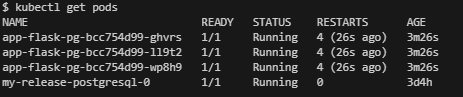
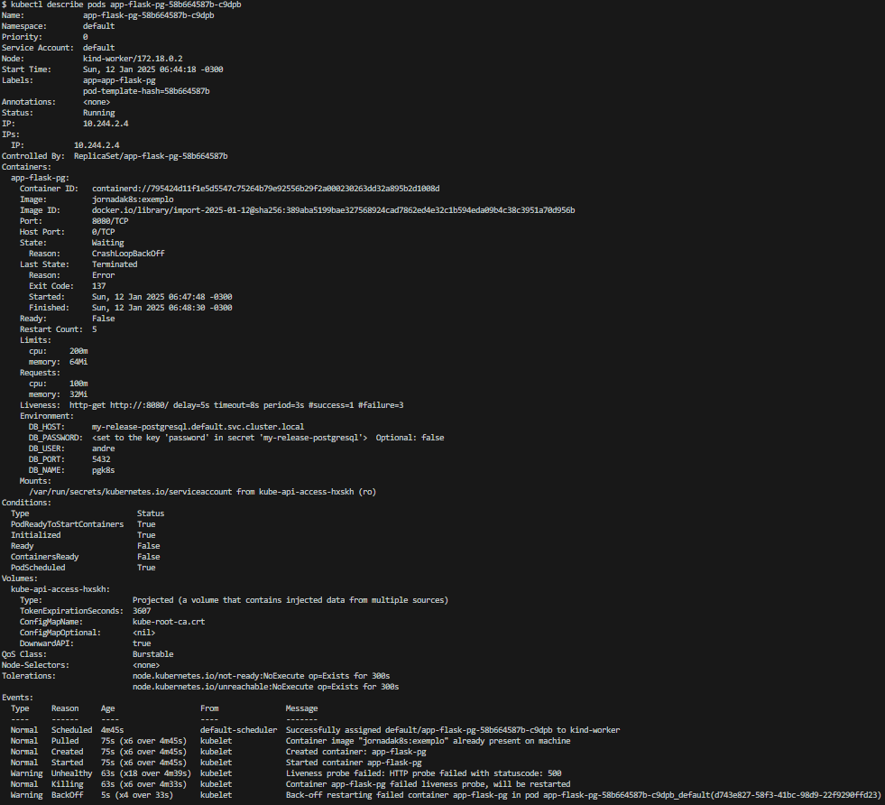
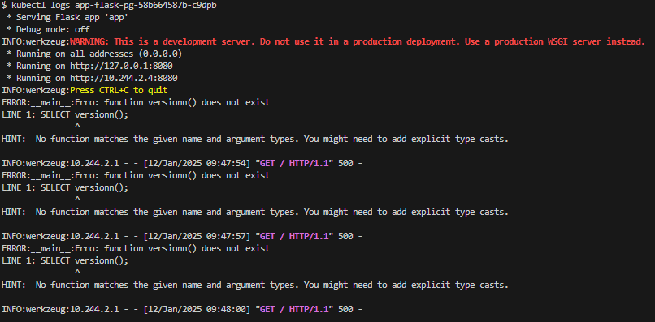

# Introdução à Resolução de Problemas em Kubernetes

Este documento complementa o capítulo "Introdução à Resolução de Problemas em Kubernetes".

## Exemplo prático de resolução de problemas

**Objetivo**

- Simular um cenário de indisponibilidade em uma aplicação rodando em um cluster kubernetes e como seria uma possível atuação para resolução de problemas, utilizando a estratégia sugerida no livro.

**Cenário:**
- Temos uma aplicação python definida em [`app.py`](exemplo-pratico/app.py) que faz uma conexão com um banco de dados postgres e realiza uma consulta para obter a versão desse banco posgres. 
- Utilizamos um [`Dockerfile`](exemplo-pratico/Dockerfile) para criar a imagem da aplicação, incluindo suas dependencias([`requirements.txt`](exemplo-pratico/requirements.txt)). 
- Criamos o manifesto de um Deployment [`app-deployment.yaml`](exemplo-pratico/app-deployment.yaml) para implantar a aplicação no cluster kubernetes.
- Está instalado no cluster um banco postgres utilizando o helm chart bitnami/postgresql, com as definições do banco em [`values.postgres.yaml`](exemplo-pratico/values.postgres.yaml)
- Vamos simular 2 erros, um referente ao código da aplicação e outro referente a configuração do Deployment.

**Início:**

**1 - Observar os sintomas:** 
Começam a chegar registros de usuários relatando erro ao acessar a aplicação. A partir daí identificamos o namespace da aplicação (no exemplo, usaremos somente o namespace default) e vamos verificar os dashboards referente a aplicação, por exemplo o volume de requisições HTTP ao longo do tempo. Confirmada a indisponibilidade, temos todos os usuários impactados, vamos iniciar a verificação do cluster. 
 

**2 - Consultar recursos:** 
Vamos começar verificando a saúde dos nós e dos pods do namespace da aplicação:

Todos os nós estão com STATUS `Ready`, então a princípio não há problema com os nós.

Em seguida, vamos verificar os pods:

Veja que embora o STATUS dos pods da aplicação seja `Running`, eles estão reiniciando muitas vezes em pouco tempo, já sendo uma evidência de comportamento indesejado. Até que após alguns reinícios:

o STATUS dos pods é alterado para `CrashLoopBackOff` e é reiniciado indefinidamente, até que o problema seja solucionado.

**3 - Detalhar recursos:**
Vimos que os pods da aplicação `app-flask-pg` apresentam problemas, então vamos nos aprofundar na análise buscando mais informações sobre os pods:

Podemos ver várias informações sobre nosso pod, detalhes sobre seu status além da lista de eventos que ocorreram com o pod.

Chamarei a atenção para algumas informações, pois são campos que trazem informações importantes na hora de solucionar problemas:

- `State`: traz informações sobre o estado atual do pod
- `LastState`: traz informações sobre o estado anterior do pod, incluindo o motivo(`Reason`), código de saída(`Exit Code`), além de horário de início e término(`Started` e `Finished`).
- `Environment`: lista as váriáveis de ambiente e/ou secrets que foram definidas para o pod. No exemplo, podemos ver as variáveis referentes às credenciais do banco de dados(`DB_HOST`,`DB_PASSWORD`,`DB_USER`,`DB_PORT`,`DB_NAME`).
- `Events`: exibe os eventos ocorridos com o pod, onde cada evento conta com os campos tipo(`Type`), motivo(`Reason`), idade(`Age`), origem(`From`) e mensagem(`Message`). 

**4 - Analisar logs:**

Em seguida vamos consultar o log do pod para uma análise do ponto de vista da aplicação.

Podemos ver na figura que ao tentar fazer uma conexão com o banco de dados, é retornada uma mensagem com código de erro 500 acompanhado da mensagem `Erro ao conectar com o banco de dados: connection to server at "my-release-postgresql.default.svc.cluster.local" (10.96.47.159), port 5433 failed: timeout expired` indicando que não foi possível realizar a conexão com o banco de dados.

Ok, estamos com problemas com a conexão do banco, vamos começar verificando os dados usados nessa conexão. Temos o servidor que corresponde a `my-release-postgresql.default.svc.cluster.local` e a porta `5433`.

Sabemos que a porta padrão do postgres é a `5432`, mas para nos certificarmos de quais os valores esperados para esses campos, devemos listar os `Services`, em especial o chamado de  `my-release-postgresql`, que corresponde ao nosso banco de dados.

Perceba que o service que queremos consultar(`my-release-postgresql`) está escutando na porta 5432, diferentemente do que mostra o erro no log do pod.

Assim identificamos que há um erro de configuração em um recurso kubernetes, mais especificamente no `Deployment`.

**Observação**: No exemplo, o valor que queremos corrigir está no manifesto do `Deployment` da aplicação(`app-deployment.yaml`). Foi utilizada uma definição muito simples e com os valores das variáveis de ambiente explícitas no código apenas para fins didáticos. Nunca exponha esse tipo de dado dentro do código. Preze pelas boas práticas e segurança.

**5 - Verificar eventos:**

Aqui vemos os eventos de uma forma mais abrangente do que a lista de eventos mostrada no passo 3. O comando `kubectl get events` traz os eventos de todos os pods do namespace. No nosso exemplo, podemos ver que os 3 pods estão continuamente reiniciando e apresentando erro. 

**6 - Interagir com os conteineres:**

Nesse momento não é necessário interagir diretamente com o pod para a resolução do nosso problema. Vou enviar um comando `hostname` para um dos pods apenas para demonstrar a interação com o pod e ele retornará o nome do host, que é o mesmo nome do pod.

**7 - Isolar o problema:**

Após essas primeiras verificações, verificamos que a porta usada para fazer a conexão com o banco de dados estava incorreta, o que leva a crer que é um problema de configuração do kubernetes. A variável de ambiente `DB_PORT` está definida no manifesto `app-deployment.yaml` e é lá que vamos corrigí-la.

**8 - Implementar a solução:**

Após efetuar a alteração da porta de 5433 para 5432, vamos subir a nova versão do deployment. 

Vamos ver os novos pods:

Podemos efetuar o comando describe para confirmar se a variável está como esperado:

Podemos ver que de fato `DB_PORT` está com o valor 5432. Porém vemos na mesma consulta que o pod está apresentando erro e com status de `CrashLoopBackOff`. 

Vamos validar o comportamento da aplicação fazendo uma nova consulta ao log do pod.

Primeira observação ao analisar esse log é que o erro atual é diferente do primeiro. Estávamos com um problema para fazer a conexão com o banco. Agora vemos que é exibido um erro informando que a função solicitada não existe. Isso significa que a aplicação conseguiu conectar no banco mas ao realizar uma consulta(`SELECT versionn()`) obteve uma resposta de erro informando que há um problema com o comando SQL utilizado. Dessa forma, podemos concluir que o erro que estávamos tratando foi solucionado e a aplicação conseguiu conectar com o banco de dados. Entretanto nos deparamos com outro erro, que também precisa ser analisado e resolvido. 

A partir de agora, continuarei com a análise do nosso exemplo de forma mais fluída (sem fazer a separação dos passos), mas repetindo o mesmo fluxo que seguimos até aqui.

Conforme vimos no último log, continuamos a receber erro código 500, mas com a mensagem: `Erro: function versionn() does not exist`. Ela é bem clara em afirmar que está sendo chamada uma função que não existe. Ao examinar o nome da função, podemos perceber um aparente erro de escrita com a letra `n` aparecendo duas vezes em `versionn()`. Uma vez que a consulta SQL parte da aplicação, teoricamente quem deveria resolver seria o time de desenvolvimento responsável pela aplicação, mas no caso do nosso exemplo, vamos fazer a correção no código, buildar uma nova imagem e iniciar um novo deploy da aplicação. 
Recapitulando, vamos corrigir a consulta SQL para `SELECT version()` e esperamos que essa alteração traga a resposta esperada do banco de dados.

Trecho do código onde está o erro:

OBS.: Utilizei alguns comandos me ajudar no processo de deploy registrados no script `deploy.sh`, também disponibilizado neste repositório.

Ao fazer um novo deploy, vejamos os pods:

Já podemos ver que não deu nenhum restart na aplicação, vamos detalhar mais um pouco:

analisando o resultado do describe, demonstra um funcionamento normal do pod. Vale destacar a seção `Events` onde não foi registrada nenhuma mensagem de falha. Além disso temos o estado(`State`) apresentando valor `Running` e o contador de restart(`Restart Count`) estar zerado, que são mais evidências do bom funcionamento do pod.

Finalmente, vamos consultar o log da aplicação para validarmos a solução:

Perfeito! A aplicação está respondendo com código 200(Sucesso) com a mensagem: `Hello from Flask! PostgreSQL version: ('PostgreSQL 17.2 on x86_64-pc-linux-gnu, compiled by gcc (Debian 12.2.0-14) 12.2.0, 64-bit',)`