# Deployments 

Este material complementa a seção sobre Deployments, fornecendo exemplos e explicações sobre manifestos, escalonamento, rollback e estratégias de atualização.

## Manifesto YAML

A seguir um exemplo de um manifesto básico de um Deployment:

```yaml
apiVersion: apps/v1
kind: Deployment
metadata:
  name: nginx-deployment
  labels:
    app: nginx
spec:
  replicas: 3
  selector:
    matchLabels:
      app: nginx
  strategy:
    type: RollingUpdate
    rollingUpdate:
      maxSurge: 1
      maxUnavailable: 0
  template:
    metadata:
      labels:
        app: nginx
    spec:
      containers:
      - name: nginx
        image: nginx:1.14.2
        ports:
        - containerPort: 80
```
no exemplo, é criado um Deployment com nome de `nginx-deployment`, que cria um ReplicaSet que por sua vez, cria 3 réplicas de um pod contendo um container que utiliza uma imagem `nginx:1.14.2`.
Veremos ao listarmos o deployment e seus pods mais adiante.

No campo `template` ficam as definições referentes aos pods que serão criados a partir do Deployment.
Observe que o campo `strategy`, que se refere a estratégia de atualização, é do tipo `RollingUpdate`, que o significado veremos a seguir.

## Estratégias de atualizações

A estratégia de atualização vai especificar como os antigos Pods serão substituídos pelos novos Pods. Temos duas opções de estratégias:

- **Recreate**: nessa estratégia todos os pods existentes são encerrados antes dos novos serem criados. É uma estratégia bem simples, mas que gera alguma indisponibilidade até quando os novos pods estiverem prontos.
  
- **RollingUpdate**: é a estratégia padrão do Deployment. Consistem em substituir os pods antigos pelos novos um a um, de forma que não haja indisponibilidade, pois sempre haverá um ou mais pods rodando.

## Listando um Deployment e seus pods

Para listar Deployments, utilizamos o comando: 

``` kubectl get deployment nginx-deployment``` 

na figura também mostramos a listagem dos pods correspondente ao deployment:

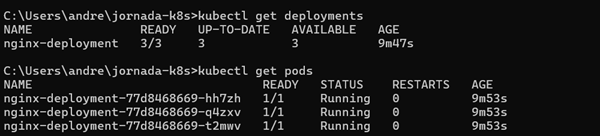

Perceba que esses comandos já nos trazem algumas informações básicas.

## Detalhando um Deployment

Para consultarmos maiores detalhes sobre um Deployment, utilizamos o comando: 

``` kubectl describe deployment nginx-deployment``` 

a resposta esperada do comando será parecida com:

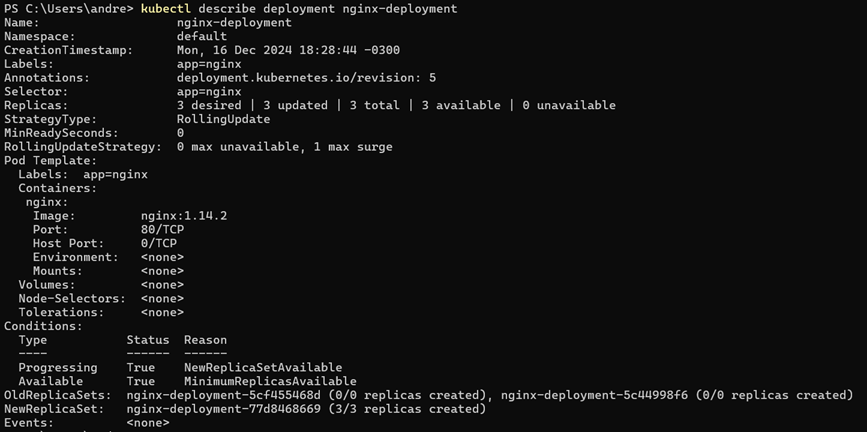

Podemos ver todos os detalhes sobre nosso deployment, inclusive os antigos e novos ReplicaSets dele.

## Escalando um Deployment

No contexto de Deployments, escalar significa aumentar ou diminuir o número de réplicas de acordo com sua demanda com objetivo de aproveitar melhor os recursos computacionais e financeiros. 
Você pode escalar um Deployment usando o seguinte comando: 

``` kubectl scale deployment/nginx-deployment --replicas=10 ```

Onde é especificado:

`deployment/nginx-deployment`: nome do deployment que será escalado

`--replicas=10`: define a nova quantidade de replicas o deployment deve possuir

Será exibida uma saída parecida com:

``` deployment.apps/nginx-deployment scaled ```

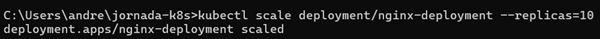

Nesse momento são criadas as replicas necessárias para atender o novo estado desejado, ou seja, inicialmente tinhamos 3 réplicas, são criadas mais 7 réplicas, totalizando as 10 que foram solicitadas no comando.

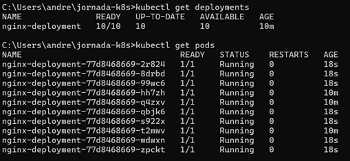

## Atualizando um Deployment
Imagine que queremos atualizar a imagem nginx utilizada pelo deployment, alterando de `nginx:1.14.2` para `nginx:1.26.2`. Dessa forma, usamos o comando:

``` kubectl set image deployment/nginx-deployment nginx=nginx:1.26.2 ```

Onde é especificado:

`deployment/nginx-deployment`: nome do deployment que será atualizado

`nginx`: nome do container que será atualizado

`nginx:1.26.2`: nova imagem e tag que será atribuída ao container

Será exibida uma saída parecida com:

``` deployment.apps/nginx-deployment image updated ```

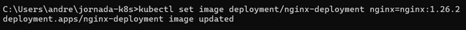

Nesse momento é criado um novo ReplicaSet, que criará 3 réplicas usando a nova imagem, de forma que para cada pod criado com a imagem nova, um pod rodando com a imagem anterior é encerrado, até que só existam os pods com a nova imagem.

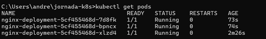

Perceba que os nomes dos pods são diferentes de antes da atualização.


## Verificando o histórico de atualizações de um Deployment

Cada alteração que fazemos fica registrado no histórico do Deployment e é chamado de ``` revision ``` . 
Para listar esse históricos, usamos o comando:

``` kubectl rollout history deployment/nginx-deployment ```


Para consultarmos o conteúdo de cada revision, usamos:

```  kubectl rollout history deployment/nginx-deployment --revision=REVISION ```

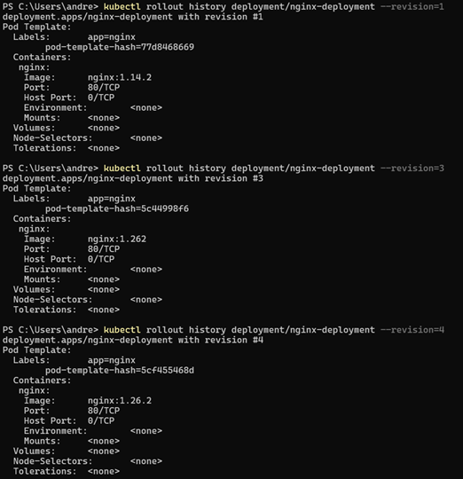

## RollBack de versões 

Digamos que você definiu a imagem errada em uma atualização de Deployment e precisa reverter a alteração. Utilizamos o `rollout undo` para fazer a reversão:

``` kubectl rollout undo deployment/nginx-deployment ```

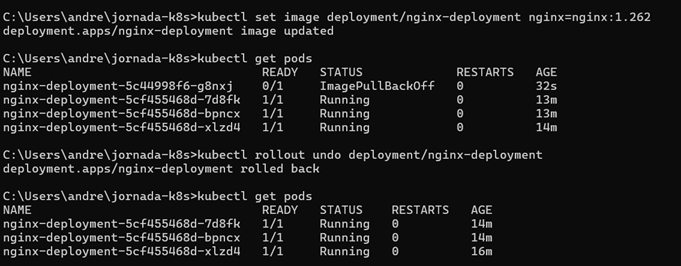

O comando efetuado dessa forma retorna para revision imediatamente anterior, mas ele também aceita que você informe a revision para qual você quer mudar. Digamos que queremos voltar para a revision 1, onde usamos a imagem `nginx:1.14.2` :

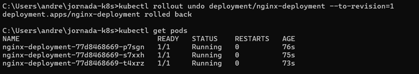

Foram criados novos pods, todos com a imagem `nginx:1.14.2`.

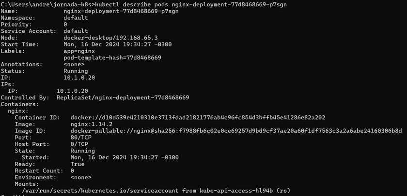

## Deletando um Deployment

Para deletar um Deployment, utilizamos o comando:

``` kubectl delete deployment nginx-deployment```

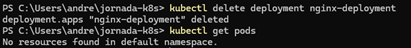


Perceba que todos os pods foram removidos junto com seu Deployment
