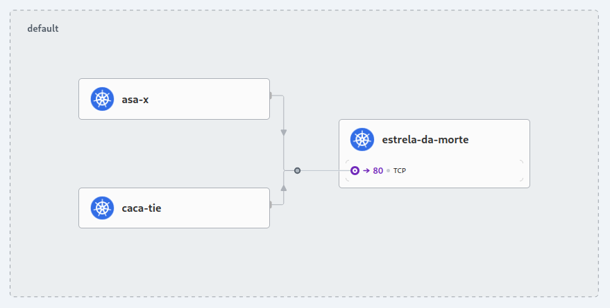

# eBPF e sua relevância no ecossistema Kubernetes

Códigos da seção 1.27, "eBPF e sua relevância no ecossistema Kubernetes".

## Tutorial

Visando facilitar na parte prática, deixamos aqui o passo-a-passo que está no livro.

Para seguir este exemplo, precisaremos que você tenha as seguintes ferramentas instaladas: 
- [docker](https://www.docker.com/) (>= v27.2.1)
- [helm](https://helm.sh/) (>= v3.13.0)
- [kubectl](https://kubernetes.io/pt-br/docs/reference/kubectl/) (>= v1.14.0)
- [kind](https://kind.sigs.k8s.io/) (>= v0.7.0)
- [cilium](https://github.com/cilium/cilium-cli)

Observação sobre a instalação do `cilium`: Em algumas distribuições Linux, como as baseadas em Arch, pode ser que você encontre problemas seguindo o método "oficial" no site do Cilium. Nesse caso, procure pela ferramenta no seu gerenciador de pacotes. Para Arch, está disponível via pacman como `cilium-cli` (crie um alias `cilium` -> `cilium-cli` para seguir com os comandos do tutorial ou adapte os comandos).

No que segue, assumimos que o `docker` pode ser executado por um usuário não-root. Se não for seu caso, você pode [permitir](https://docs.docker.com/engine/install/linux-postinstall/) essa funcionalidade ou simplesmente usar `sudo` antes dos comandos.


Na raiz do projeto, navegue até a seção de eBPF:
```sh
cd secao-01-introducao/ebpf
```

Em env.sh, definimos variáveis de ambiente para facilitar nossa vida.
```sh
source env.sh
```

Agora, vamos criar o cluster. Para isso, o arquivo `cluster.yml` contém as configurações iniciais. Nosso cluster se chamará `jornada-k8s-ebpf`. Ele terá 4 nodes, 1 control plane e 3 workers, assim nossa simulação se aproxima um pouco mais de um ambiente produtivo.

Nessa configuração, desativamos a interface de rede padrão dos containers (CNI, Container Network Interface) para depois colocar o Cilium em seu lugar, quando o cluster estiver de pé.
Por padrão, as subnets de pod e service usadas pelo Kind são as do arquivo, ou seja, não precisavam estar ali - deixamos explícitas para que você possa ajustá-las em caso de conflitos com sua rede local.

Para subir o cluster:
```sh
kind create cluster --config source/cluster.yml
```

Como desativamos o CNI padrão, os workers vão ficar com status `NotReady` até a instalação do Cilium. 
```sh
kubectl get nodes | awk '{print $1, $2}' | column -t

# NAME                        	    STATUS
# jornada-k8s-ebpf-control-plane	NotReady
# jornada-k8s-ebpf-worker     	    NotReady
# jornada-k8s-ebpf-worker2    	    NotReady
# jornada-k8s-ebpf-worker3    	    NotReady
```

Conferindo o progresso:
```sh
kubectl cluster-info --context $CONTEXT
```

Agora iremos adicionar o Cilium ao cluster. Pegamos sua imagem docker e a carregamos nos workers. Isso pode demorar alguns minutos.

```sh
docker pull quay.io/cilium/cilium:$CILIUM_TAG
kind load docker-image quay.io/cilium/cilium:$CILIUM_TAG -n $CLUSTER_NAME
```

Em seguida, adicionamos o repositório helm do Cilium e depois instalamos.
```sh
helm repo add cilium https://helm.cilium.io/
helm install cilium cilium/cilium --version $CILIUM_VERSION \
   -n kube-system \
   --set image.pullPolicy=IfNotPresent \
   --set ipam.mode=kubernetes
```

Caso tenha dado certo, você deve ver uma mensagem do tipo "You have successfully installed Cilium with Hubble".

Com tudo funcionando, vamos agora habilitar o Hubble UI em nossa instalação do Cilium.
```sh
helm upgrade cilium cilium/cilium --version $CILIUM_VERSION \
   -n kube-system \
   --reuse-values \
   --set hubble.relay.enabled=true \
   --set hubble.ui.enabled=true
```

Em seguida, esperamos pelas mudanças.
```sh
cilium status --wait
```

Agora vamos subir a interface gráfica localmente.
```sh
cilium hubble ui
```

Acesse `localhost:12000`. Esta é a interface gráfica do Cilium Hubble. Ela estará disponível enquanto o comando não for interrompido.

Existem muitas funcionalidades na Hubble UI. Fique à vontade para explorar. Como exemplo, iremos subir a demonstração do StarWars, que pode ser encontrada na documentação oficial do Cilium.

São três microsserviços: 
- `estrela-da-morte` (Estrela da Morte)
- `caca-tie` (Caça TIE)
- `asa-x` (Asa-X)

A Estrela da Morte roda um webserver HTTP na porta `80` que fornece serviços de pouso para as naves do império, dizendo onde podem aterrissar. Sua porta é exposta como um service do Kubernetes para balancear a carga em duas réplicas da aplicação. 

Já a Caça TIE representa uma nave usual do Império, capaz de enviar solicitações para pousar na Estrela da Morte. Por fim, Asa-X é uma nave da aliança (os rebeldes). Tal qual a Caça TIE, ela também envia requisições de pouso na Estrela da Morte.

A Estrela da Morte quer impedir que naves rebeldes pousem e garantir que as Caça TIE consigam algum lugar para aterrissar. Esse cenário vai nos ajudar a entender como o Cilium pode ser útil. 

Bora começar! Abra outra aba de terminal, ainda no caminho `secao-01-introducao/ebpf`, e crie os microsserviços:
```sh
kubectl create -f source/starwars.yml
```

Prossiga depois que tudo estiver de pé. Para acompanhar o progresso dos deploys,
```sh
kubectl get pod,svc
```

Cada pod será representado como um Endpoint no agente do Cilium. Agora vamos executar os pedidos de pouso para as duas naves.

```sh
kubectl exec caca-tie -- curl -s -XPOST estrela-da-morte.default.svc.cluster.local/v1/request-landing

# Ship landed

kubectl exec asa-x -- curl -s -XPOST estrela-da-morte.default.svc.cluster.local/v1/request-landing

# Ship landed
```

Como ainda não restringimos quem pode pousar, os dois pedidos foram aprovados. Na interface gráfica, se você selecionar o namespace default, verá algo como a imagem a seguir:



Vamos agora usar o Cilium para somente permitir pousos de pods que tenham org: imperio. Uma política desse tipo, geralmente é chamada de L3/L4, porque o filtro se baseia nos protocolos IP (camada 3) e TCP (camada 4). Por simplicidade, vamos tratar as políticas sempre como a camada mais alta. Nesse caso, L4. Esta política pode ser definida pelo código em `politica_l4.yml`.

Vamos aplicá-la:
```sh
kubectl create -f source/politica_l4.yml
```

Agora, vamos pousar com o Caça Tie:
```sh
kubectl exec caca-tie -- curl -s -XPOST estrela-da-morte.default.svc.cluster.local/v1/request-landing

# Ship landed
```

Segue funcionando, como esperado. Se tentarmos pousar com a Asa X, no entanto, a requisição será bloqueada.
```sh
kubectl exec asa-x -- curl -s -XPOST estrela-da-morte.default.svc.cluster.local/v1/request-landing
```

Execute `CTRL+C` para liberar o terminal. Podemos saber as regras que estão operando através de:
```sh
kubectl get cnp

# NAME 		AGE
# regra1   	4m34s
```

Caso queira ver o código de alguma regra, basta fazer como em outros recursos do Kubernetes:
```sh
kubectl describe cnp regra1
```

Na vida real, no entanto, os requisitos vão ser mais específicos. Até aqui, fizemos um bloqueio completo de tráfego. E se precisarmos de algo mais granular? 

Imagine agora que nossa Estrela da Morte tenha um endpoint que não deve ser usado por outras aplicações, seu propósito é servir para infraestrutura ou manutenção, por exemplo. Quando usado por uma aplicação, problemas podem acontecer.
```sh
kubectl exec caca-tie -- curl -s -XPUT estrela-da-morte.default.svc.cluster.local/v1/exhaust-port

# Panic: deathstar exploded

# goroutine 1 [running]:
# main.HandleGarbage(0x2080c3f50, 0x2, 0x4, 0x425c0, 0x5, 0xa)
#     	/code/src/github.com/empire/deathstar/
#     	temp/main.go:9 +0x64
# main.main()
#     	/code/src/github.com/empire/deathstar/
#     	temp/main.go:5 +0x85
```

Queremos impedir que naves do Império acessem esse endpoint. Nesse caso, será uma política L7, pois está na camada HTTP. O exemplo a seguir define uma política que limita Caça Tie a requisições POST em `v1/request-landing` e proíbe todo o resto. O código se encontra em `politica_l7.yml`.

Repare que ela é uma atualização da política anterior, por isso mantemos o mesmo nome. Vamos executá-la com `kubectl apply` (`kubectl create` daria erro, pois já existe!).
```sh
kubectl apply -f source/politica_l7.yml
```

Agora, ao tentar alcançar o endpoint que aplicações não deveriam acessar, recebemos `Access Denied`.
```sh
kubectl exec caca-tie -- curl -s -XPUT estrela-da-morte.default.svc.cluster.local/v1/exhaust-port

# Access denied
```

Já se tentarmos pousar com o Caça Tie, tudo funciona normalmente.
```sh
kubectl exec caca-tie -- curl -s -XPOST estrela-da-morte.default.svc.cluster.local/v1/request-landing

# Ship landed
```

Por fim, vamos fazer uma bagunça no cluster. Execute o seguinte comando:
```sh
while true; do cilium connectivity test; done
```

Agora, mude o namespace na interface gráfica para o `cilium-test-1`. Como você pode ver, as dependências entre os serviços são descobertas dinamicamente e as requisições ficam disponíveis. Quanto mais complexa a carga de trabalho envolvida, mais útil o Cilium tende a ser. Tudo isso é possível graças a eBPF!

Para limpar o que fizemos, dê `CTRL+C` nas duas abas do terminal (Hubble UI e while loop). Em seguida, vamos deletar o cluster, remover a imagem Docker e o repositório helm do Cilium:
```sh
kind delete cluster -n $CLUSTER_NAME \
&& docker rmi quay.io/cilium/cilium:$CILIUM_TAG \
&& helm repo remove cilium
```

Agora seu sistema deve estar limpo das bagunças que fizemos!
